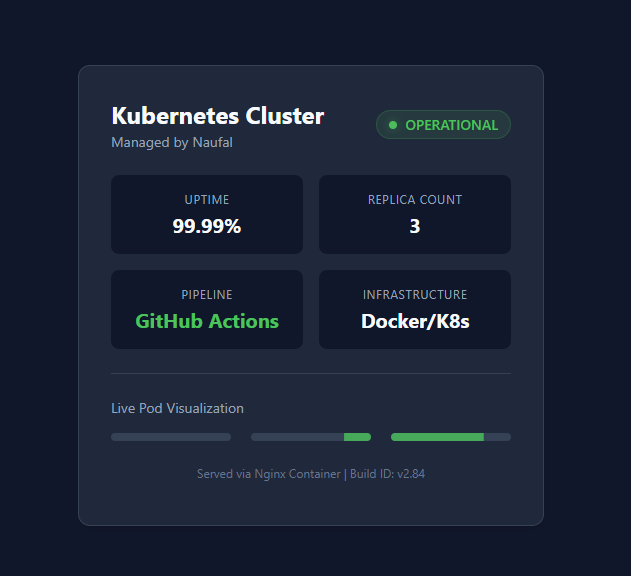

# 🚀 DevOps & Kubernetes Portfolio Project


A fully automated, self-healing web infrastructure deployed on Kubernetes. This project demonstrates high-availability architecture, automated rollouts, and infrastructure-as-code principles.

---

## 📸 Project Dashboard
**Mission Control Status:**



---

## 🏗️ Architecture Highlights

### 1. Self-Healing Infrastructure
* **ReplicaSets:** Configured `spec.replicas: 3` to ensure zero downtime. If a pod crashes, Kubernetes instantly spins up a replacement.
* **Liveness Probes:** Implemented health checks. If the application freezes, the cluster automatically restarts the container.

### 2. Automated Deployments
* **Rolling Updates:** Configured deployment strategies to update the application without dropping user connections.
* **Declarative Configuration:** All infrastructure is defined in YAML (`deployment.yaml`), allowing for version-controlled infrastructure.

### 3. Container Management
* **Dockerized Environment:** Custom Nginx image built with optimized configuration layers.
* **Resource Optimization:** Minimized container footprint using Alpine-based Linux distributions.

---

## 🛠️ How to Run
**Prerequisites:** Docker Desktop (Kubernetes Enabled)

1. **Clone the Repo**
   ```bash
   git clone [https://github.com/naufallofty/my-devops-demo.git](https://github.com/naufallofty/my-devops-demo.git)
   cd my-devops-demo
